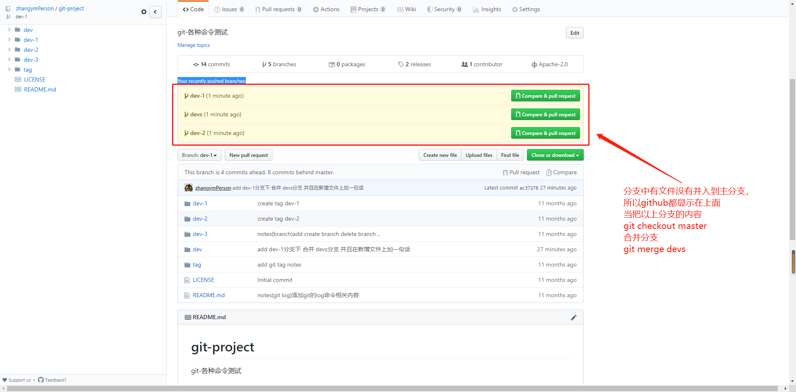

# git-project
git-各种命令测试
# 主要测试创建分支 合并分支 创建版本号

- 合并分支

```sh

# 切换到要合并入的分支
$ git checkout branchName
# 将其他分支合并到当前分支
$ git merge branchName

# 在合并时创建一个新的合并后的提交
$ git merge --no-ff branchName

```

- 日志查看
```sh
log
显示这个版本库的所有提交

# 显示所有提交
$ git log

# 显示某几条提交信息
$ git log -n 10

# 仅显示合并提交
$ git log --merges
merge
合并就是将外部的提交合并到自己的分支中

```

# clone远程仓库非master分支

- 解决方法

```sh

#直接使用命令
#查看远程分支
$ git branch -r 


#查看所有分支
$ git branch -a 

#然后直接 其中* * 代表分支名
$ git checkout origin/*/*

```


### git 多远程仓库的配置 推送

- 注意

    git clone {address} 和 git remote add gitName {address}

    这两种 命令 如果 address是以 https开头的参数
    如:https://gitee.com/ZhangYanMingGood/git-project.git
    则需要使用用户名和密码才能推送和拉取

    如果address是以 git@***.com
    如:git@gitee.com:ZhangYanMingGood/git-project.git
    则需要使用ssh密钥 进行推送和拉取

    修改删除密码在 windows 下 windows凭据 里面进行操作  看对应仓库对应的数据

### 已有本地仓库推送到线上的仓库

- 提交命令
    git remote add {gitname} {address}

    eg: git remote add gitee git@gitee.com:ZhangYanMingGood/git-project.git
    
    在本地仓库执行以上命令 就是添加一个远程仓库到本地配置中

    然后推送使用命令

        git push -u gitee master

        其中gitee 代表远程仓库的别名 master代表本地分支
    
- git 推送所有分支到远程 仓库的方式

    git push --mirror 推送所有分支进入到远程仓库  
    
    git push --all origin 推送所有分支到远程仓库
        
## 注意

- 所有分支要并入master上

    github上如果提交的分支中有内容没有在master分支下，则会在主页显示没有合并到master的分支，并推荐你合并到主分支下

    